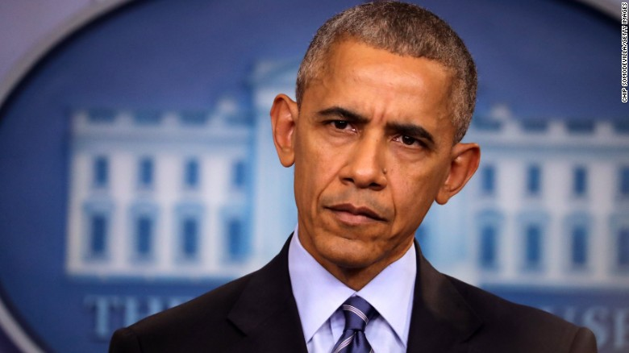
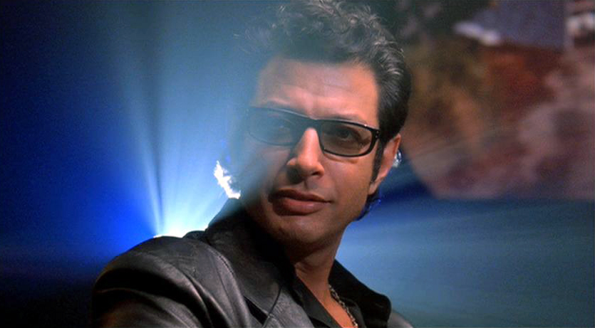

> Detailed report: [DEMO-1-Report.pdf](Documents/DEMO-1-Report.pdf).    

# Folder structure:
`dataset`: training dataset which folder name is name/identity of a object.

`face_detection_model`: stores model configuration and pretrained weights of SSD.

`ISR`: image super resolution module. We didnt integrate it into out source because ISR took long time to produre results. To play with it: 
- Firstly, you need to clone ISR: `git clone https://github.com/idealo/image-super-resolution` and use [image_super_resolution.py](ISR/image_super_resolution.py) script to run.
- [Pretrained model](ISR/rdn-C6-D20-G64-G064-x2_ArtefactCancelling_epoch219.hdf5) are also provided.

`output`: contains some pickle files
- [embeddings.pickle](output/embeddings.pickle): stores embedding images or 128-d feature vectors of training dataset.
- [le.pickle](output/le.pickle): corresponding labels for embedding images.
- [recognizer.pickle](output/recognizer.pickle): stores trained model of SVM for face recognition.

`test_images`: test images for evaluating model

Face detection: [face_detection.py](face_detection.py) for image and [face_detection_video.py](face_detection_video.py) for video-stream.

Facial landmarks and alignment: [facial_landmark.py](facial_landmark.py) with pretrained model `shape_predictor_68_face_landmarks.dat` to extract facial keypoints.

Embedding image: [extract_embeddings.py](extract_embeddings.py) based on pretrained OpenFace model `openface_nn4.small2.v1.t7`.

Training SVM for identifying objects: `train_model.py`. 

Face recognition: [recognize.py](recognize.py) for image and [recognize_face_video.py](recognize_face_video.py) for video.

# Dataset:
<table>
    <tr>
        <th>Object</th>
        <th>#Images</th>
    </tr>
    <tr>
        <td>
            <figure>
                
                <figcaption>adrian</figcaption>
            </figure>
        </td>
        <td>
            6
        </td>
    </tr>
    <tr>
        <td>
            <figure>
                
                <figcaption>taylor</figcaption>
            </figure>
        </td>
        <td>
            10
        </td>
    </tr>
    <tr>
        <td>
            <figure>
                
                <figcaption>justin_bieber</figcaption>
            </figure>
        </td>
        <td>
            10
        </td>
    </tr>
    <tr>
        <td>
            <figure>
                
                <figcaption>obama</figcaption>
            </figure>
        </td>
        <td>
            10
        </td>
    </tr>
    <tr>
        <td>
            <figure>
                
                <figcaption>unknown</figcaption>
            </figure>
        </td>
        <td>
            6
        </td>
    </tr>
</table>

# Installation
```
pip install -r requirements.txt
```

# Usage:
Face recognition for static image:
```bash
python recognize.py -i test_images/obama_1_hi.jpg \ # path to image 
        -d ./face_detection_model/ \ # path to OpenCV's face detector  
        -m ./openface_nn4.small2.v1.t7 \ # path to OpenCV's face embedding model 
        -r ./output/recognizer.pickle \ # SVM model for face recognition 
        -l ./output/le.pickle \ # labels
        -c 0.5 # face threshold
```
Face recognition for video:
```bash
python recognize.py -i path/to/video 
        -d ./face_detection_model/ \ # path to OpenCV's face detector  
        -m ./openface_nn4.small2.v1.t7 \ # path to OpenCV's face embedding model 
        -r ./output/recognizer.pickle \ # SVM model for face recognition 
        -l ./output/le.pickle \ # labels
        -c 0.5 # face threshold
```