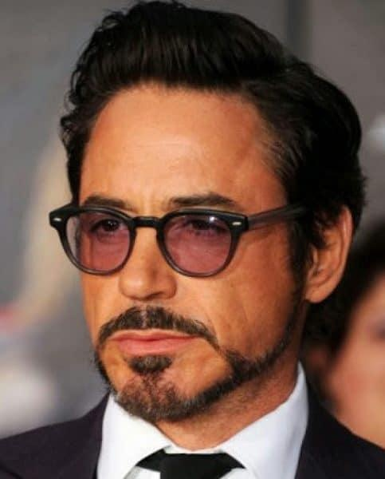
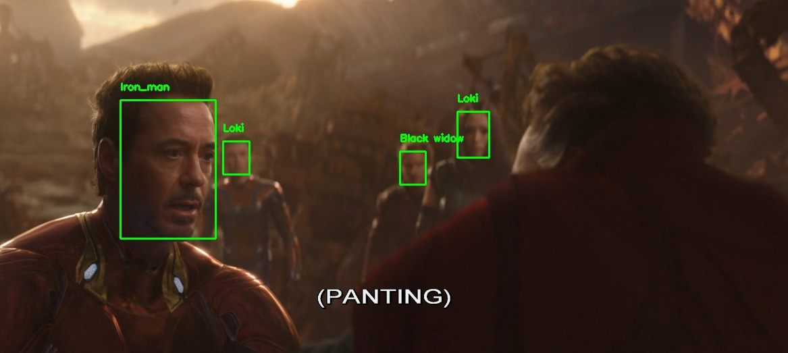
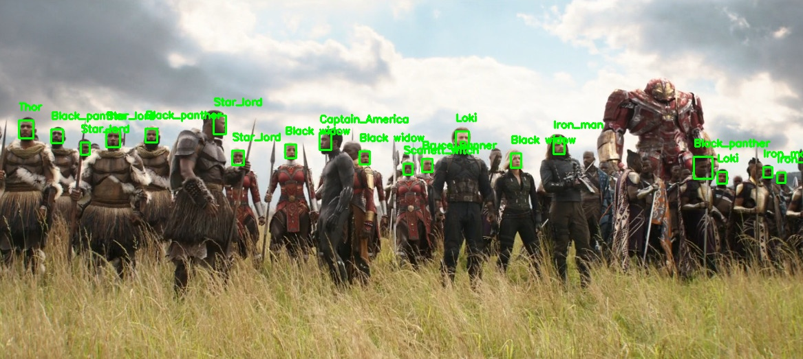
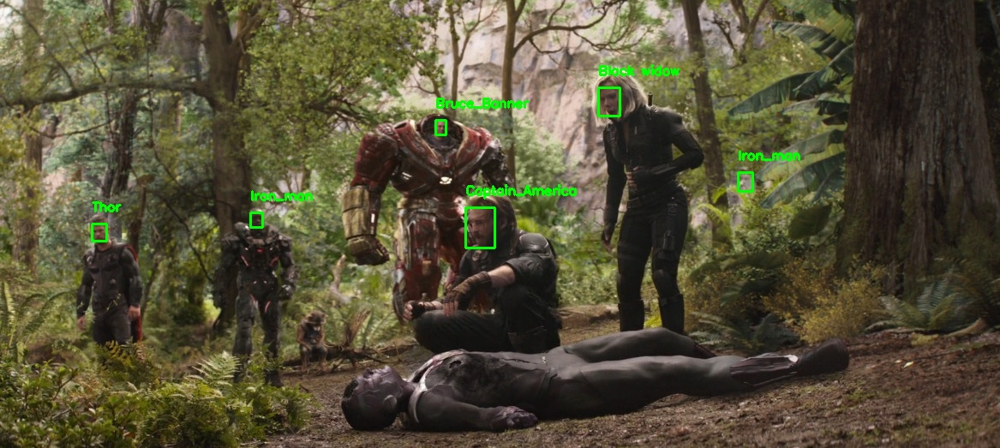

> Detailed report: [DEMO-2-Report.pdf](../Documents/DEMO-2-Report.pdf)

This demo utilized MTCNN instead of SSD to capture objects with variety of scales, illumination, viewpoints, etc.
Other procedures are the same as [Demo1](../Demo1). 

# Folder structure:
`Input`: containes 25 test images (1100x500)

`Output`: recognition results for 25 test images which include  bounding box of face and name of object. 

`Pickle`:
- `avenger5.pickle`: stores embedding vectors from dataset.
- `label.pickle`: labels for each character (i.e. name).
- `trainedSVM.pickle`: trained weights of SVM model on dataset.

`Src`: source code
- [ServiceMTCNN](Src/ServiecMTCNN): source code of MTCNN
- `encode.py`: extracts embedding image for dataset and serialize to file.
- `SVM_train.py`: for training SVM
- `recognize_faces.py`: wrap up all procedures to detect, extract embeddings, recognize object and display output.

# Dataset:
<table>
    <tr>
        <th>Object</th>
        <th>#Images</th>
    </tr>
    <tr>
        <td>
            <figure>
                
                <figcaption>Black window</figcaption>
            </figure>
        </td>
        <td>
            79
        </td>
    </tr>
    <tr>
        <td>
            <figure>
                
                <figcaption>Black_panther</figcaption>
            </figure>
        </td>
        <td>
            100
        </td>
    </tr>
    <tr>
        <td>
            <figure>
                
                <figcaption>Bruce_Banner</figcaption>
            </figure>
        </td>
        <td>
            127
        </td>
    </tr>
    <tr>
        <td>
            <figure>
                
                <figcaption>Captain_America</figcaption>
            </figure>
        </td>
        <td>
            94
        </td>
    </tr>
    <tr>
        <td>
            <figure>
                
                <figcaption>Doctor_Strange</figcaption>
            </figure>
        </td>
        <td>
            156
        </td>
    </tr>
    <tr>
        <td>
            <figure>
                
                <figcaption>Iron_man</figcaption>
            </figure>
        </td>
        <td>
            110
        </td>
    </tr>
    <tr>
        <td>
            <figure>
                
                <figcaption>Loki</figcaption>
            </figure>
        </td>
        <td>
            127
        </td>
    </tr>
    <tr>
        <td>
            <figure>
                
                <figcaption>Scarlett_Witch</figcaption>
            </figure>
        </td>
        <td>
            142
        </td>
    </tr>
    <tr>
        <td>
            <figure>
                
                <figcaption>Star_lord</figcaption>
            </figure>
        </td>
        <td>
            134
        </td>
    </tr>
    <tr>
        <td>
            <figure>
                
                <figcaption>Thor</figcaption>
            </figure>
        </td>
        <td>
            145
        </td>
    </tr>
</table>

# Usage:
```bash
python recognize_faces.py --image Input/1.jpg # path to input image \
    --encodings Pickle/avenger5.pickle # embedding file of avenger dataset
```

# Results:





# References:
[1] https://github.com/ageitgey/face_recognition

[2] https://github.com/davidsandberg/facenet

[3] Blog: https://www.pyimagesearch.com/2018/06/18/face-recognition-withopencv-python-and-deep-learning/

[4] Sklearn: https://scikitlearn.org/stable/modules/generated/sklearn.svm.LinearSVC.html#sklearn.svm.LinearSVC

[5] https://forum.machinelearningcoban.com/t/crawl-nhanh-hinh-anhtu-google-image-cho-bat-ki-chu-de-nao-ban-can/2510

[6] https://github.com/hardikvasa/google-images-download