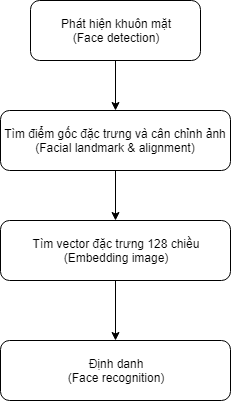

# Face-recognition

## Introduction
This is case study in Pattern recognition subject. We study Face Recognition At a Distance (FRAD) but there are a lot of challenges such as: Optics and Light Intensity, Exposure Time and Blur, Image Resolution and Pose, Illumination and Expression. Also, FRAD need to set up a system that has several cameras like wide field of view (WFOV) and narrow field of view (NFOV). This project is based on this article [1].

Rigorous reports for FRAD: [FRAD_report.pdf](./Documents/FRAD_report.pdf) and [FRAD_representation.pptx](./Documents/FRAD_prepresentation.pptx).

There are 2 demos:
- [Demo1](./Demo1/): It used for presentation at class. We trained model with small dataset. We used Single Shot Detector (SSD) model with ResNet architecture for detecting object. For more details, please check out our report at [DEMO-1-Report.pdf](./Documents/DEMO-1-Report.pdf).
- [Demo2](./Demo2/): We improved the performance for face detection at long distance and various scale, light condition by utilizing Multi-task CNN. After that, we trained SVM classifier on large dataset which was collected by us. This dataset cover some characters in "Avenger: Infinity war" movie such as: Black window, Black Panther, Bruce Banner,... Why we choose them because Avenger video has a lot of point of views, scales and light conditions. For more details, please check out our report at [DEMO-2-Report.pdf](./Documents/DEMO-2-Report.pdf).

Team members:
<table>
    <tr>
        <th>StudentID</th>
        <th>Full Name</th>
        <th>Email</th>
    </tr>
    <tr>
        <td>1612174</td>
        <td>Phùng Tiến Hào</td>
        <td><a href="mailto:tienhaophung@gmail.com">tienhaophung@gmail.com</a></td>
    </tr>
    <tr>
        <td>1612269</td>
        <td>Võ Quốc Huy</td>
        <td><a href="mailto:voquochuy304@gmail.com">voquochuy304@gmail.com</a></td>
    </tr>
    <tr>
        <td>1512211</td>
        <td>Trần Quang Huy</td>
        <td>NA</td>
    </tr>
</table>

## Basic procedures:

In [Demo1](./Demo1), we adopted SSD for detecting object. We also used image enhancement resolution likes Ganerative Aversarial Network (GAN) for doing this task. Particularly, we just enhanced image resolution for image with low resolution. We didn't integrate this process into our system because GAN take a long time to enhance image resolution.

In [Demo2](./Demo2), we used Multi-task CNN for detecting object. Literally, Multi-task CNN is better SSD because it can capture objects (faces) in various scales, light conditions, head views and even occlusion. 

## Source code
You can click at corresponding source liked [Demo1](./Demo1) or [Demo2](./Demo2) where each has its own REAMDE for clarification.

## Reference:
[1] Wheeler, Frederick W., Richard L. Weiss, and Peter H. Tu. "Face recognition at a distance system for surveillance applications." 2010 Fourth IEEE International Conference on Biometrics: Theory, Applications and Systems (BTAS). IEEE, 2010.
